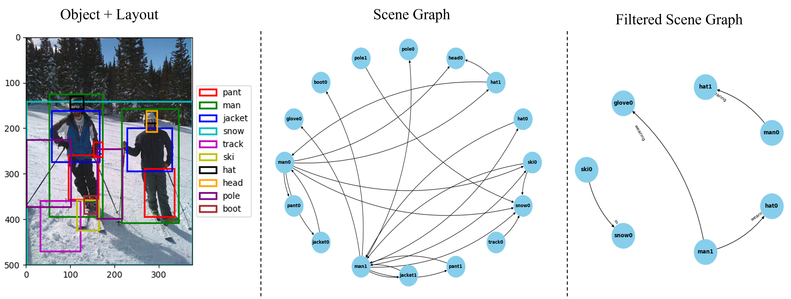

# Transmit What You Need: A Task-Adaptive Semantic Communications for Visual Information

## Installation
```
pip install -r requirements.txt
```

## Usage
### Visaul Semantics Extraction
Download [pretrained model](https://drive.google.com/file/d/1id6oD_iwiNDD6HyCn2ORgRTIKkPD3tUD/view) which is pretrained on the Visual Genome dataset. Then, put it under `pretrained` directory.

With the comand
'''
python inference.py --img_path $IMAGE_PATH --result_path $RESULT_PATH --resume $MODEL_PATH
'''
extracted visual semantics(objects, layouts, SG, and filtered SG) are saved in `result_path` as a json file.

without arguments
'''
python inference.py
'''
utilizes image 'example/2407349.jpg' and the results are saved as 'example_result/2407349.json'.

### Visualization
To visulaize extracted semantics:
'''
python visualize.py --img_path $IMAGE_PATH --result_path $RESULT_PATH
'''

We attached visualized semantics on `example/2407349.jpg`. For clarity, `Filtered Scene Graph` only depicts informative relations. 

<p align="center">
  
</p>

### Generation

